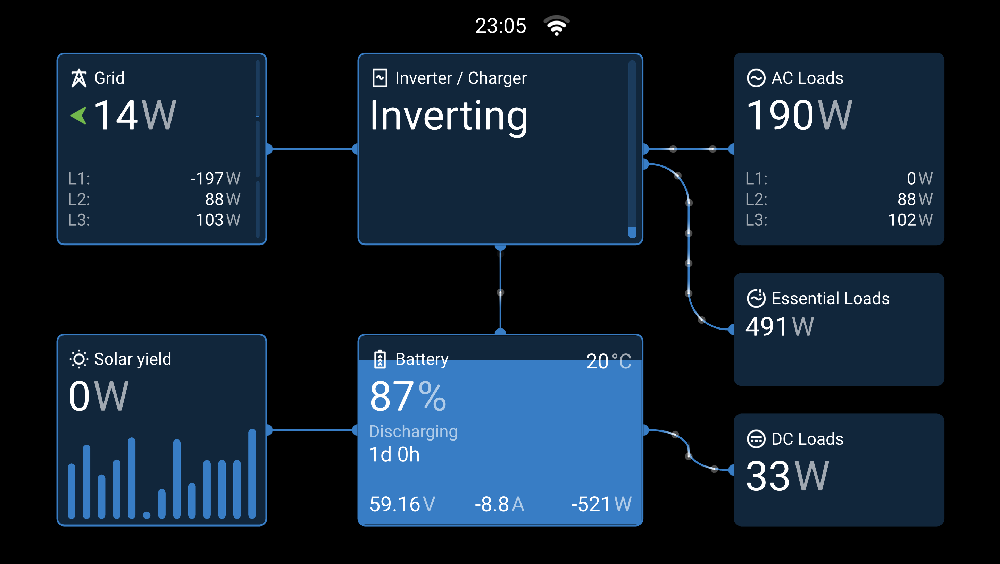
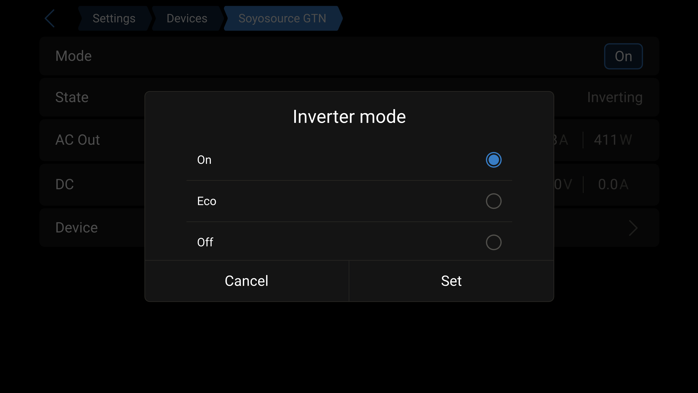
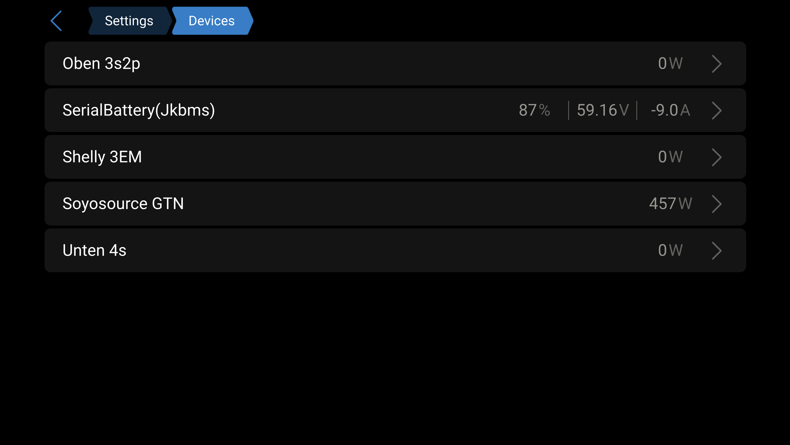
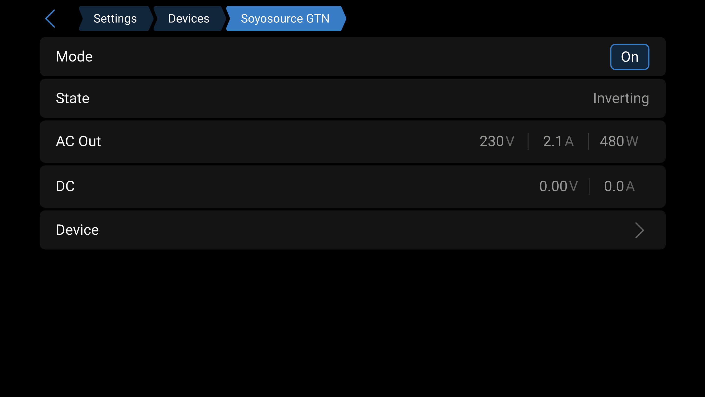

# dbus-soyosource

Bridge between [Victron Energy VenusOS](https://www.victronenergy.com/panel-systems-remote-monitoring/cerbo-gx)
and a [Soyosource GTN grid-tie inverter](https://www.soyosource.com/) over RS-485.

The service runs on the GX device (e.g. Cerbo GX, or a Raspberry Pi running
VenusOS), reads the current grid power from VenusOS D-Bus, and continuously
tells the Soyosource how much to produce so that the grid sees only a small
import buffer — i.e. it discharges the battery to cover whatever the house is
pulling from the grid, without ever exporting.



```
   Grid meter        PV chargers        BMS
   (Shelly / EM24)   (MPPT, optional)   (optional)
           \              |              /
            \             |             /
             \            |            /
              \           |           /
               ▼          ▼          ▼
        ┌─────────────────────────────────┐
        │   VenusOS GX device             │
        │   (Cerbo GX, Ekrano, Pi, …)     │
        │                                 │
        │   com.victronenergy.system      │
        │     /Ac/Grid/L<n>/Power ────┐   │
        │                             │   │
        │   dbus-soyosource (this) ◄──┘   │
        └───────────────┬─────────────────┘
                        │ RS-485 (4800 8N1)
                        ▼
                Soyosource GTN inverter
                        │
                        ▼
                   Battery (DC)
```

The service publishes itself as `com.victronenergy.inverter.soyosource_<N>`
so the inverter shows up in the GUIv2 **Inverter / Charger** tile and in
the VRM portal.

## Hardware

* **VenusOS GX device** — Cerbo GX, Color Control GX, MultiPlus-II GX, Ekrano,
  or a Raspberry Pi running [Venus OS Large](https://github.com/victronenergy/venus/wiki/raspberrypi-install-venus-image).
* **Soyosource GTN inverter** — tested with a 1200 W single-phase model; any
  GTN with the standard "virtual meter" RS-485 input should work.
* **USB-to-RS-485 adapter** — tested with a [DSD TECH SH-U11F](https://www.dsdtech-global.com/2019/05/usb-to-rs485.html)
  (FT232R + dual SP3490 transceivers, full-duplex but A+/B- works for the
  half-duplex Soyosource bus). Any FTDI-based USB-RS-485 dongle that's known
  to work on Linux should do — avoid no-name adapters that silently use
  CH340/CH341 quirks.
* **Wiring** — connect the adapter's `A+` and `B-` to the same labelled pins on
  the Soyosource RS-485 input. Ground is optional but recommended for long runs.
  No termination resistor needed at typical household lengths and 4800 baud.

The grid power must be available on the VenusOS D-Bus already — typically
from a Carlo Gavazzi EM24/EM530, a Shelly 3EM published via
`dbus-shelly-3em-smartmeter`, or any other supported grid meter.

## Installation

1. Copy the project to `/data/dbus-soyosource/` on the GX device. From a
   workstation:

   ```bash
   scp -r victron-dbus-soyosource/ root@<gx-ip>:/data/dbus-soyosource/
   ```

   Or wget directly on the device:

   ```bash
   ssh root@<gx-ip>
   cd /data
   wget https://github.com/<your-fork>/victron-dbus-soyosource/archive/refs/heads/main.zip
   unzip main.zip && mv victron-dbus-soyosource-main dbus-soyosource
   rm main.zip
   ```

2. Identify the serial port the RS-485 adapter is on:

   ```bash
   ls -la /dev/serial/by-id/
   # look for "FTDI_FT232R_USB_UART_..." → maps to /dev/ttyUSB<N>
   ```

3. Create your local config from the template and edit it — at minimum set
   `SerialPort`, `Phase` (physical wiring), and `MaxPowerDemand`. See the
   **Config parameters** section below.

   ```bash
   cd /data/dbus-soyosource
   cp config.ini.example config.ini
   vi config.ini
   ```

   `config.ini` is gitignored, so your local values (serial port, limits,
   etc.) never end up in a commit if you pull updates or fork the repo.

4. Run the installer:

   ```bash
   /data/dbus-soyosource/install.sh
   ```

   This:
   * sets the executable bits on the scripts,
   * symlinks `/data/dbus-soyosource/service` into `/service/`, which
     starts the `daemontools` supervisor that keeps the Python script alive,
   * registers a hook in `/data/rc.local` so the service survives a
     VenusOS firmware update.

5. Verify it's running:

   ```bash
   svstat /service/dbus-soyosource
   tail -F /var/log/dbus-soyosource/current
   ```

   You should see `INFO dbus-soyosource: Grid=… demand … -> …` lines every
   few seconds, and the Soyosource should appear in the GUIv2 **Inverter /
   Charger** tile as "Inverting".

### Updating

After editing source files locally, redeploy and trigger a restart:

```bash
scp dbus-soyosource.py soyosource.py root@<gx-ip>:/data/dbus-soyosource/
ssh root@<gx-ip> "svc -t /service/dbus-soyosource"
```

(Don't scp `config.ini` — the device copy is your local-only config and
would be overwritten. Edit it in place on the device instead.)

`svc -t` sends SIGTERM, which lets the service send 0 W shutdown frames before
exiting; daemontools then restarts it with the new code.

### Uninstall

```bash
/data/dbus-soyosource/uninstall.sh
```

## Config parameters

All configuration lives in `config.ini`. It is read once at startup —
**changes require a service restart** (`svc -t /service/dbus-soyosource`).

There is no live-tuning UI. The four control-loop parameters
(`MaxPowerDemand`, `MinPowerDemand`, `TargetGridW`, `Damping`) used to be
exposed as editable settings under `Settings → Devices → Soyosource GTN`, but
that added a lot of complexity (localsettings registration, bidirectional
sync, first-run-only semantics) for something that in practice gets set once
and left alone. `config.ini` is now the single source of truth.

The only runtime switch is the **Inverter mode** (On / Eco / Off), documented
below.

### `config.ini`

| Key | Default | Effect |
|---|---|---|
| `SerialPort` | `/dev/ttyUSB3` | Serial port the RS-485 adapter is on. Use `ls /dev/serial/by-id/` to find the right one; prefer a stable `/dev/serial/by-id/...` path since `ttyUSB<N>` numbers can shuffle on reboot. |
| `Phase` | `L1` | Physical wiring: which AC phase the Soyosource is fed into. Reported on `/Settings/System/AcPhase` and used for the `/Ac/Out/<phase>/*` D-Bus paths. Valid values: `L1`, `L2`, `L3`. |
| `TrackPhase` | `ALL` | Which grid-meter reading(s) the control loop follows. `L1`/`L2`/`L3` = read one phase path. `ALL` = sum `/Ac/Grid/L1/Power` + `L2` + `L3`. Use `ALL` if your utility meter nets all phases for billing (typical in the EU) — a single-phase inverter on `L1` can then offset loads across all three phases. Use a specific phase if your billing is *per-phase* (some older installs), or if you only want to compensate loads on the wiring phase. |
| `DeviceInstance` | `41` | Unique D-Bus device instance. Must not collide with other Victron devices on the same system. The service registers as `com.victronenergy.inverter.soyosource_<DeviceInstance>`. Changing it after install creates a *new* device entry; clean the stale one via the GUI's *Remove disconnected devices* button. |
| `CustomName` | `Soyosource GTN` | Display name in the GUI and VRM. Cosmetic only. |
| `AcPosition` | `1` | Reserved for forward compatibility. Unused by the `inverter` service type. |
| `ServiceType` | `inverter` | D-Bus service class. Keep `inverter`; `vebus` would show power on the GUIv2 tile but crashes `dbus-systemcalc-py`'s DVCC delegate on non-Multiplus systems. See CLAUDE.md. |
| `UpdateIntervalSeconds` | `1.0` | How often the control loop reads grid power and recomputes demand. Faster = more responsive; slower = smoother. The grid meter usually only updates every 1–3 s, so values below 1 s rarely help. |
| `SendIntervalSeconds` | `0.5` | How often the current demand frame is retransmitted on RS-485. The inverter auto-offs after ~10 s without a frame — keep this well below. The OEM meter uses ~500 ms. |
| `GridStaleTimeoutSeconds` | `10` | Safety timeout. If the grid reading stops updating for this long, demand is forced to 0 W. |
| `MaxPowerDemand` | `900` | Hard upper limit (watts) on the demand frame we send. Set to the inverter's rated output (e.g. 900–1000 W for a 1200 W model — leave headroom). |
| `MinPowerDemand` | `0` | Minimum non-zero demand. If the calculated demand is between 0 and this, we send 0 W instead. Useful if your inverter has a high idle power — set to e.g. 50 W so it only runs when it can produce meaningfully. |
| `TargetGridW` | `-10` | Target reading (watts) for the tracked grid power (see `TrackPhase`). The loop drives demand so the tracked value converges here. Positive = aim to always import that much (safety margin); negative = aim to always export that much (slight overshoot, handy if you'd rather give the utility a few watts than ever buy from them); zero = exact net zero (risks brief import/export spikes from noise). |
| `Damping` | `0.3` | Fraction of the grid–target error to apply each tick. `1.0` = full correction (fastest, may overshoot slow inverters); `0.3` = gentle, default; `0.7–0.8` = snappier but can oscillate on fast-changing loads. Lower this if you see oscillation in the log. |
| `EcoPowerDemand` | `360` | Fixed power demand used when **Inverter mode** is set to Eco (see below). |
| `Logging` | `INFO` | Log level. `INFO` shows every demand change; `WARNING` is quiet; `DEBUG` dumps the raw frame hex. Logs go to `/var/log/dbus-soyosource/current`. |

### Inverter mode — On / Eco / Off

In GUIv2, the Soyosource device page has an **Inverter mode** switch with
three options. This is the only runtime control — it writes `/Mode` on our
D-Bus service and the control loop responds immediately.

| Mode | D-Bus value | Behaviour |
|---|---|---|
| **On** | `2` | Normal grid-following control loop. Reads the grid meter (per `TrackPhase`) and drives the inverter so the tracked value settles at `~TargetGridW`. This is the default on startup. |
| **Eco** | `5` | Fixed-output mode. Sends `EcoPowerDemand` watts (default 360 W) continuously, regardless of grid readings. Useful for scheduled fixed-rate discharge (e.g. Node-RED at night) without any grid-meter dependency. |
| **Off** | `4` | Silent. The service stops transmitting on RS-485 entirely; the inverter auto-offs after ~10 s. A short burst of 0 W frames is sent on the transition so the inverter drops to zero immediately. |

The mode is **not persisted** — a service restart always comes back up in
`On`. If you want the inverter genuinely off across reboots, stop the service
(`svc -d /service/dbus-soyosource`) instead.



### How the control loop works (On mode)

Every `UpdateIntervalSeconds`:

1. Read the tracked grid power from `com.victronenergy.system` — a single
   `/Ac/Grid/<P>/Power` path for `TrackPhase=L1|L2|L3`, or the sum of all
   three paths for `TrackPhase=ALL`.
2. If the reading hasn't changed by ≥ 1 W since the last action, *skip* — this
   prevents runaway ramping while the upstream meter is holding a value.
3. Compute `error = grid_power - TargetGridW`. Positive = the tracked value
   is above target (need to produce more); negative = below target (back off).
4. New demand = `last_demand + error * Damping`, clamped to
   `[MinPowerDemand, MaxPowerDemand]` (or 0 if below `MinPowerDemand`).
5. Every `SendIntervalSeconds`, retransmit the current demand frame on RS-485.

Safety: if grid data goes stale (no update for `GridStaleTimeoutSeconds`),
demand is forced to 0. On `SIGTERM`/`SIGINT`, the service sends five 0 W
frames before exiting.

## Verifying it works

* **Inverter LCD** — should show the commanded output power within ~3 seconds
  of the service starting. A 1200 W model typically delivers 95–98 % of the
  commanded value (i.e. tell it 300 W and the LCD shows ~290 W).

* **Grid meter** — the tracked grid power should drop towards `TargetGridW`.
  Watch the per-phase readings with:

  ```bash
  watch -n1 'for p in L1 L2 L3; do \
      printf "%s = " "$p"; \
      dbus -y com.victronenergy.system /Ac/Grid/$p/Power GetValue; \
    done'
  ```

* **Service log** — `tail -F /var/log/dbus-soyosource/current` shows every
  demand change, e.g. `mode=On grid=156.4W demand 80 -> 175`.

* **GUIv2** — `http://<gx-ip>/gui-v2/` should show "Inverter / Charger:
  Inverting". Under **Settings → Devices** you'll find a `Soyosource GTN`
  entry showing the current output power:

  

  The device detail page shows the current AC output and the **Inverter
  mode** switch (On / Eco / Off — see above):

  

## Known limitations

* **No status feedback** — most Soyosource mainboards (notably the 2022
  "purple" revision) do not respond to RS-485 status queries. The service
  still attempts to read in case a future firmware enables it; until then,
  `/Dc/0/*` and `/Temperature` on the D-Bus service stay empty. We have no
  way to detect inverter faults from the bus — only from the LCD.

* **GUIv2 Inverter/Charger tile shows state, not power.** The wattage is on
  the device detail page (one tap away). This is a tradeoff to avoid the
  `vebus` service type, which would show the power but breaks `dbus-systemcalc-py`
  on non-Multiplus systems. See CLAUDE.md for the full story.

* **Single-phase only.** The service follows one phase of the grid meter.
  Multi-phase setups need one service instance per inverter (not yet
  supported in this code, but straightforward to add).

* **One inverter per service.** Multiple inverters would each need their own
  serial adapter and config — `power_demand_divider` from the ESPHome project
  is not implemented.

## Files

| File | Purpose |
|---|---|
| `dbus-soyosource.py` | Main service — D-Bus, serial, control loop. |
| `soyosource.py` | Pure protocol module: frame build/parse, checksum, demand calculation. Has no D-Bus or serial dependencies. |
| `config.ini.example` | Template for the startup config. Copy to `config.ini` and edit. |
| `config.ini` | Your local startup config. Gitignored — not in the repo. |
| `service/run` | daemontools entry point (started via `/service/dbus-soyosource`). |
| `service/log/run` | multilog setup → `/var/log/dbus-soyosource/`. |
| `install.sh` | Symlinks the service into `/service/` and registers in `rc.local`. |
| `restart.sh` | Sends SIGTERM to the running service; daemontools restarts it. |
| `uninstall.sh` | Removes the symlink and stops the service. |
| `CLAUDE.md` | Engineering notes — protocol details, gotchas, design decisions. |

## Credits

Initial scaffolding (D-Bus integration, install scripts, daemontools setup)
borrowed from [henne49/dbus-opendtu](https://github.com/henne49/dbus-opendtu)
and ultimately [fabian-lauer/dbus-shelly-3em-smartmeter](https://github.com/fabian-lauer/dbus-shelly-3em-smartmeter).

The Soyosource RS-485 protocol is fully documented (and validated) in the
[esphome-soyosource-gtn-virtual-meter](https://github.com/syssi/esphome-soyosource-gtn-virtual-meter)
project — without that reference this would have taken much longer.

## References

* [Victron D-Bus API](https://github.com/victronenergy/venus/wiki/dbus)
* [Victron D-Bus PV inverter / inverter spec](https://github.com/victronenergy/venus/wiki/dbus#pv-inverters)
* [How to get root access on a GX device](https://www.victronenergy.com/live/ccgx:root_access)
* [esphome-soyosource-gtn-virtual-meter](https://github.com/syssi/esphome-soyosource-gtn-virtual-meter) — protocol reference
